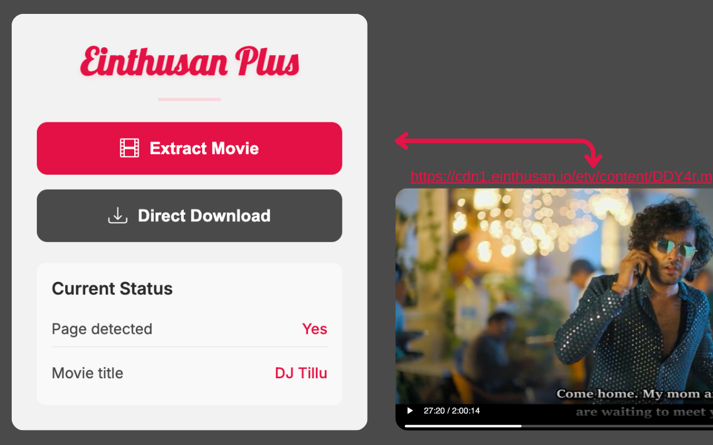

<div align="center">
  
</div>

---

<div align="center">
  <a href="https://developer.chrome.com/docs/extensions/" target="_blank" rel="noreferrer"></a>
  <a href="https://developer.mozilla.org/en-US/docs/Web/JavaScript" target="_blank" rel="noreferrer"></a>
  
  <a href="https://chromewebstore.google.com/detail/einthusan-plus/mkheidmfaklmfkhkfilfcofenhgblefe" target="_blank" rel="noreferrer"></a>
</div>

---

Einthusan Plus enhances your Einthusan.tv experience by allowing you to download movies for offline viewing and enjoy an ad-free environment, all completely free.

<div align="center">
  
</div>

## Project Links

-   **Chrome Extension:** https://chromewebstore.google.com/detail/einthusan-plus/mkheidmfaklmfkhkfilfcofenhgblefe


## Project Structure

```text
einthusan-plus/
├── extension/
│   ├── manifest.json
│   ├── public/
│   │   └── icons/
│   └── src/
│       └── popup/
├── assets/
└── README.md
```

## Installation

1. **Clone the repo**

    ```bash
    git clone https://github.com/Siddharthmr/Einthusan-Plus.git
    ```

2. **Load the extension**

    - Open `chrome://extensions`
    - Enable **Developer mode**
    - Click **Load unpacked** and select the `extension/` folder